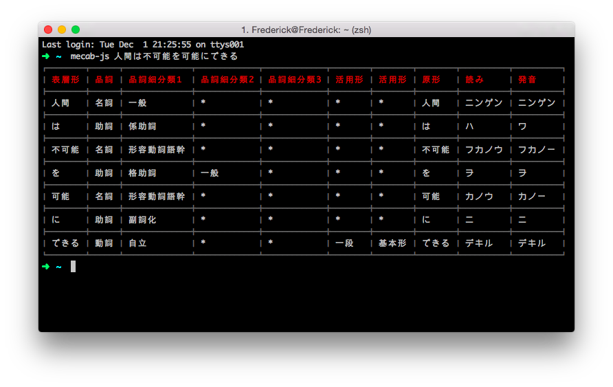

# mecab-js

[](https://greenkeeper.io/)
Use MeCab in Node.js

## Installation
### Install MeCab
Download `mecab-x.x.tar.gz` and `mecab-ipadic-2.7.0-x.tar.gz` from [MeCab downloads](https://drive.google.com/folderview?id=0B4y35FiV1wh7fjQ5SkJETEJEYzlqcUY4WUlpZmR4dDlJMWI5ZUlXN2xZN2s2b0pqT3hMbTQ&usp=drive_web#list).

```
tar zxfv mecab-x.x.tar.gz
cd mecab-x.x
./configure
make
sudo make install
```

```
tar zxfv mecab-ipadic-2.7.0-x.tar.gz
cd mecab-ipadic-2.7.0-x
./configure --with-charset=utf8
make
sudo make install
```

### Install mecab-js
```
npm install mecab-js -g
```

## Usage
```
$ mecab-js 人間は不可能を可能にできる
```



## License
MIT.
